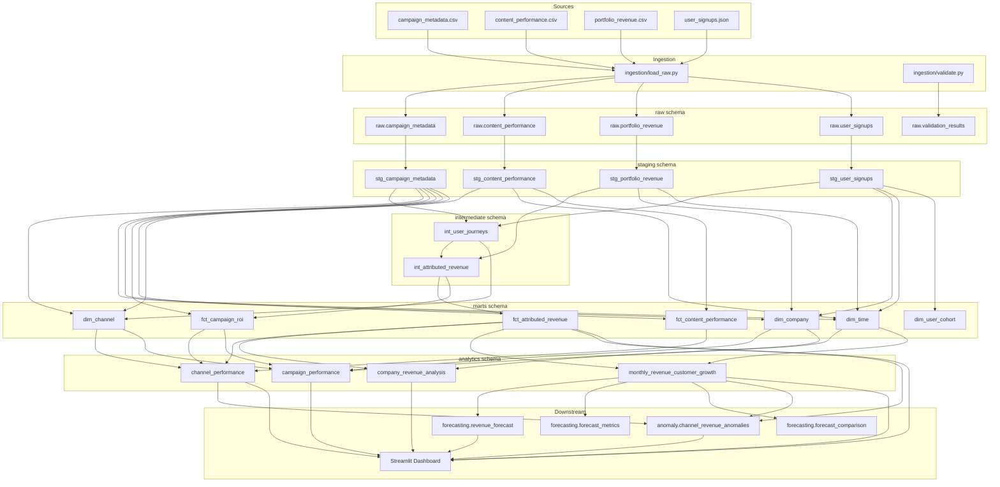

# Data Lineage

End-to-end documentation of how data moves through the Revenue Intelligence Platform —
from immutable source files to analytics, forecasting, anomaly detection, and the
Streamlit dashboard.

This document is **lineage and architecture only**. It does not change pipeline logic.

---

## 1. Architecture Overview

The platform is a local DuckDB warehouse fed by four assessment source files. Python
ingestion loads raw tables; dbt transforms raw → staging → intermediate → marts →
analytics; Python jobs write forecasting and anomaly outputs; Streamlit reads the
warehouse in read-only mode.

```text
CSV / JSON Source Files
        │
        ▼
   Raw Tables (raw.*)
        │
        ▼
 Staging Models (staging.*)
        │
        ▼
 Intermediate Models (intermediate.*)
        │
        ▼
 Dimension & Fact Tables (marts.*)
        │
        ▼
   Analytics Layer (analytics.*)
        │
        ├──────────────► Forecasting (forecasting.*)
        │
        ├──────────────► Anomaly Detection (anomaly.*)
        │
        └──────────────► Streamlit Dashboard
                              ▲
                              │
              forecasting.* ──┘
              anomaly.* ──────┘
```

Primary warehouse file: `warehouse.duckdb` at the repository root.

---

## 2. Mermaid Data Lineage Diagram



---

## 3. Layer-by-Layer Explanation

### Raw

| | |
|---|---|
| **Purpose** | Preserve source grain and values without cleaning or attribution. |
| **Inputs** | `campaign_metadata.csv`, `content_performance.csv`, `portfolio_revenue.csv`, `user_signups.json` |
| **Outputs** | `raw.campaign_metadata`, `raw.content_performance`, `raw.portfolio_revenue`, `raw.user_signups`, `raw.validation_results` |
| **Transformations** | Typed `CREATE OR REPLACE` loads in a single transaction via `ingestion/load_raw.py`. Validation results are written by `ingestion/validate.py`. |

### Staging

| | |
|---|---|
| **Purpose** | Light cleanup and typing for analytics-ready source tables. |
| **Inputs** | All `raw.*` business tables |
| **Outputs** | `staging.stg_campaign_metadata`, `stg_content_performance`, `stg_portfolio_revenue`, `stg_user_signups` |
| **Transformations** | Null empty strings, normalize channel labels, derive campaign slugs, standardize dates/numerics. **No attribution logic.** |

### Intermediate

| | |
|---|---|
| **Purpose** | Journey stitching and revenue attribution. |
| **Inputs** | Staging signups, campaigns, and portfolio revenue |
| **Outputs** | `intermediate.int_user_journeys`, `intermediate.int_attributed_revenue` |
| **Transformations** | Resolve first/last-touch channels (touch → UTM → referral → `unknown`); match campaigns by slug, date window, company, and channel when valid; attach quality flags (`campaign_match_status`, `attribution_confidence`, conflict/missing UTM). Join journeys onto revenue grain. |

### Marts

| | |
|---|---|
| **Purpose** | Conformed star schema for reusable analytics. |
| **Inputs** | Staging + intermediate models |
| **Outputs** | Dimensions: `dim_channel`, `dim_company`, `dim_time`, `dim_user_cohort`. Facts: `fct_attributed_revenue`, `fct_campaign_roi`, `fct_content_performance` |
| **Transformations** | Surrogate/date keys, conformed descriptors, campaign ROI/ROAS from attributed revenue, content facts with optional campaign linkage. |

### Analytics

| | |
|---|---|
| **Purpose** | Business-facing summaries built **only** from marts. |
| **Inputs** | Mart dimensions and facts |
| **Outputs** | `analytics.channel_performance`, `campaign_performance`, `company_revenue_analysis`, `monthly_revenue_customer_growth` |
| **Transformations** | Channel revenue/CTR/budget rollups; campaign ROI and cost-per-customer; company share and ARPU-style metrics; monthly revenue and customer growth rates. |

### Forecasting

| | |
|---|---|
| **Purpose** | 6-month portfolio revenue forecast. |
| **Inputs** | `analytics.monthly_revenue_customer_growth` |
| **Outputs** | `forecasting.revenue_forecast`, `forecast_metrics`, `forecast_comparison` |
| **Transformations** | Holt exponential smoothing (`trend="add"`, no seasonality) in `forecasting/run_forecast.py`; holdout MAE/RMSE/R²; residual-based prediction intervals. |

### Anomaly Detection

| | |
|---|---|
| **Purpose** | Flag channel-months that deviate from recent history. |
| **Inputs** | `analytics.channel_performance`, `analytics.monthly_revenue_customer_growth`, `marts.fct_attributed_revenue` (+ `dim_time`) |
| **Outputs** | `anomaly.channel_revenue_anomalies` |
| **Transformations** | Last-touch monthly channel revenue; prior 6-month rolling mean/std; z-score; `|z| ≥ 2.75` anomaly; severity, direction, rank, expected revenue, explanation. Excludes `unknown` and warm-up months. |

### Dashboard

| | |
|---|---|
| **Purpose** | Read-only exploration of warehouse outputs. |
| **Inputs** | Analytics, selected marts, forecasting, and anomaly tables |
| **Outputs** | Streamlit UI only (no warehouse writes) |
| **Transformations** | Filters, Plotly charts, formatting. Pages: Executive Overview, Channel, Campaign, Company, Forecast, Attribution Comparison, Anomaly Detection. |

---

## 4. Model Dependency Table

| Layer | Schema / Package | Models / Tables |
| --- | --- | --- |
| Sources | `data/` | `campaign_metadata.csv`, `content_performance.csv`, `portfolio_revenue.csv`, `user_signups.json` |
| Raw | `raw` | `campaign_metadata`, `content_performance`, `portfolio_revenue`, `user_signups`, `validation_results` |
| Staging | `staging` | `stg_campaign_metadata`, `stg_content_performance`, `stg_portfolio_revenue`, `stg_user_signups` |
| Intermediate | `intermediate` | `int_user_journeys`, `int_attributed_revenue` |
| Marts (dims) | `marts` | `dim_channel`, `dim_company`, `dim_time`, `dim_user_cohort` |
| Marts (facts) | `marts` | `fct_attributed_revenue`, `fct_campaign_roi`, `fct_content_performance` |
| Analytics | `analytics` | `channel_performance`, `campaign_performance`, `company_revenue_analysis`, `monthly_revenue_customer_growth` |
| Forecasting | `forecasting` | `revenue_forecast`, `forecast_metrics`, `forecast_comparison` |
| Anomaly Detection | `anomaly` | `channel_revenue_anomalies` |
| Dashboard | `streamlit_app/` | Reads analytics / marts / forecasting / anomaly (no new tables) |

### Key dbt `ref()` edges (simplified)

| Downstream | Upstream dependencies |
| --- | --- |
| `int_user_journeys` | `stg_user_signups`, `stg_campaign_metadata` |
| `int_attributed_revenue` | `stg_portfolio_revenue`, `int_user_journeys` |
| `fct_attributed_revenue` | `int_attributed_revenue` |
| `fct_campaign_roi` | `stg_campaign_metadata`, `int_attributed_revenue` |
| `fct_content_performance` | `stg_content_performance`, `stg_campaign_metadata` |
| `channel_performance` | `dim_channel`, `fct_attributed_revenue`, `fct_content_performance`, `fct_campaign_roi` |
| `campaign_performance` | `fct_campaign_roi`, `dim_channel`, `dim_company`, `dim_time` |
| `company_revenue_analysis` | `dim_company`, `fct_attributed_revenue` |
| `monthly_revenue_customer_growth` | `fct_attributed_revenue`, `dim_time` |

---

## 5. End-to-End Data Flow

### Where revenue first appears

Revenue enters as `portfolio_revenue.csv` → `raw.portfolio_revenue` →
`stg_portfolio_revenue`. Amounts are still unattributed at this stage.

### Where attribution is calculated

Attribution is computed in **intermediate**:

1. `int_user_journeys` resolves first/last-touch channels and optional campaign IDs.
2. `int_attributed_revenue` joins journeys onto each revenue row.

Marts then expose `fct_attributed_revenue` for downstream consumers.

### Where marketing metrics are calculated

- **Channel / content / campaign ROI** — mart facts (`fct_campaign_roi`,
  `fct_content_performance`) and analytics (`channel_performance`,
  `campaign_performance`).
- **Company and monthly growth** — `company_revenue_analysis`,
  `monthly_revenue_customer_growth`.

### Where forecasting begins

`forecasting/run_forecast.py` reads **only**
`analytics.monthly_revenue_customer_growth` and writes the `forecasting` schema.

### Where anomaly detection runs

`anomaly_detection/run_anomaly_detection.py` aggregates last-touch monthly channel
revenue from `marts.fct_attributed_revenue`, uses analytics for channel inventory and
month spine, and writes `anomaly.channel_revenue_anomalies`.

### Which tables feed the dashboard

| Page | Primary tables |
| --- | --- |
| Executive Overview | `analytics.monthly_revenue_customer_growth`, KPIs from analytics/marts |
| Channel Performance | `analytics.channel_performance` |
| Campaign Performance | `analytics.campaign_performance` |
| Company Analysis | `analytics.company_revenue_analysis` |
| Forecast | `analytics.monthly_revenue_customer_growth`, `forecasting.revenue_forecast` |
| Attribution Comparison | `analytics.channel_performance` (first vs last touch) |
| Anomaly Detection | `anomaly.channel_revenue_anomalies` (+ channel names from analytics) |

---

## 6. Business Logic Summary

### First-touch attribution

Credits a user’s earliest resolved acquisition channel (and campaign when matched).
Channel resolution order: explicit first-touch channel → `utm_source` →
`referral_source` → `unknown`.

### Last-touch attribution

Credits the latest resolved channel before signup using the same fallback order.
Campaign match requires compatible slug, signup date in campaign window, company, and
channel; otherwise campaign ID stays null.

### Revenue conservation

Singular dbt tests assert that attributed fact and analytics revenue totals/row counts
reconcile to intermediate/source revenue (no invented revenue).

### Forecasting methodology

Holt’s exponential smoothing (additive trend, no seasonality, optimized fit) produces a
6-month portfolio forecast with holdout MAE/RMSE/R² and residual-based intervals.

### Rolling z-score anomaly detection

For each non-`unknown` channel, compare monthly last-touch revenue to the prior
6-month mean/std. Flag `|z| ≥ 2.75` (moderate) and `|z| > 3.5` (severe). Output includes
expected revenue, difference, direction, rank, and plain-English explanation.

---

## 7. Validation & Quality

### Ingestion

- `ingestion/validate.py` — schema/type checks, required fields, referential warnings;
  results stored in `raw.validation_results`.
- `tests/test_ingestion.py` — pytest coverage for load/validate behavior.

### dbt generic tests

Declared in `dbt_project/models/**/schema.yml` (and related YAML): uniqueness,
not-null, relationships, and accepted values across staging, intermediate, marts, and
analytics models.

### Custom SQL assertions (`dbt_project/tests/`)

| Test | Intent |
| --- | --- |
| `assert_revenue_conservation.sql` | Mart attributed revenue conserves intermediate totals |
| `assert_analytics_revenue_conservation.sql` | Analytics rollups conserve mart revenue |
| `assert_nonnegative_fact_measures.sql` | Fact measures (e.g. budgets, revenue) ≥ 0 |
| `assert_nonnegative_analytics_measures.sql` | Analytics measures ≥ 0 |

### Forecast validation

`tests/test_forecasting.py` — pipeline runs, six future months, tables present, model
name and non-null predictions.

### Anomaly validation

`tests/test_anomaly_detection.py` — table/columns, no `unknown`, no warm-up null means,
threshold consistency, direction/rank rules, unit spike case.

### Duplicate key prevention

Uniqueness tests on natural keys such as `campaign_id`, `content_id`, `revenue_id`,
`user_id`, and month keys in analytics.

---

## 8. Technology Stack

| Component | Technology |
| --- | --- |
| Language | Python 3.10+ |
| Warehouse | DuckDB (`warehouse.duckdb`) |
| Ingestion | pandas + DuckDB SQL |
| Transformations | dbt-duckdb |
| Analytics | SQL (dbt models) |
| Forecasting | Python + statsmodels (Holt) |
| Anomaly Detection | Python + pandas rolling z-scores |
| Dashboard | Streamlit + Plotly |
| Testing | dbt tests + pytest |
| Orchestration (local) | GNU Make |
| Version Control | Git / GitHub |

---

## 9. Folder Structure

```text
.
├── data/
│   ├── raw/                  # Immutable CSV/JSON sources
│   └── processed/            # Reserved generated intermediates
├── ingestion/                # load_raw.py, validate.py
├── dbt_project/
│   ├── models/
│   │   ├── staging/
│   │   ├── intermediate/
│   │   ├── marts/
│   │   │   ├── dimensions/
│   │   │   └── facts/
│   │   └── analytics/
│   ├── tests/                # Singular SQL assertions
│   ├── macros/
│   └── dbt_project.yml
├── forecasting/              # Holt forecast pipeline
├── anomaly_detection/        # Rolling z-score anomalies
├── streamlit_app/            # Read-only dashboard
├── tests/                    # pytest (ingestion, forecast, anomaly)
├── docs/
│   └── DATA_LINEAGE.md       # This document
├── analytics/                # Reserved ad-hoc utilities
├── outputs/
├── notebooks/
├── Makefile
├── requirements.txt
└── README.md
```

---

## Rebuild Path (for lineage verification)

From the repository root:

```bash
make ingest
make validate
make transform
make forecast
make anomaly
make dashboard
```

Equivalent detailed commands are documented in the root `README.md`.
